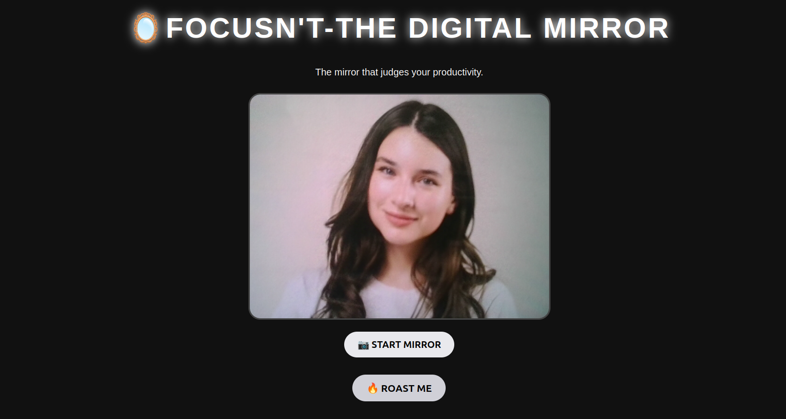

# FOCUSN'T 🎯

## The Digital Mirror That Roasts You
### Team Name: IVY

### Team Members
- Team Lead: Unnimaya B -
- Member 2: Fathimathul Rana B - 

### Project Description
FOCUSN'T is a fun browser-based digital mirror that uses the webcam to detect faces and display humorous productivity and college-related roasts instead of compliments. 

### The Problem (that doesn't exist)
Students need motivation to study, so we made a mirror that roasts them. 💀

### The Solution (that nobody asked for)
A digital mirror that detects your face and roasts your productivity. 🔥🪞

## Technical Details
### Technologies/Components Used
For Software:
- HTML – webpage structure. 
- CSS – design and styling. 
- JavaScript – camera control, face detection logic, and roasts. 
- @vladmandic/face-api – pre-trained face detection.
- Tiny Face Detector – lightweight real-time face detection
- Python HTTP server – runs the project locally. 

### Implementation
For Software:
# Installation
sudo apt update
sudo apt install python3

# Run
python3 -m http.server 8000

### Project Documentation
For Software:

# Screenshots 

*Add caption explaining what this shows*

*Add caption explaining what this shows*

# Diagrams

*Add caption explaining your workflow*

### Project Demo
# Video
[Add your demo video link here]
*Explain what the video demonstrates*

# Additional Demos
[Add any extra demo materials/links]

## Team Contributions
- [Name 1]: [Specific contributions]
- [Name 2]: [Specific contributions]
- [Name 3]: [Specific contributions]

---
Made with ❤️ at TinkerHub Useless Projects 

